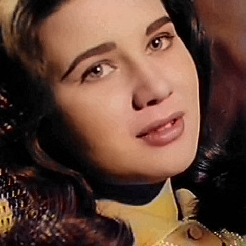
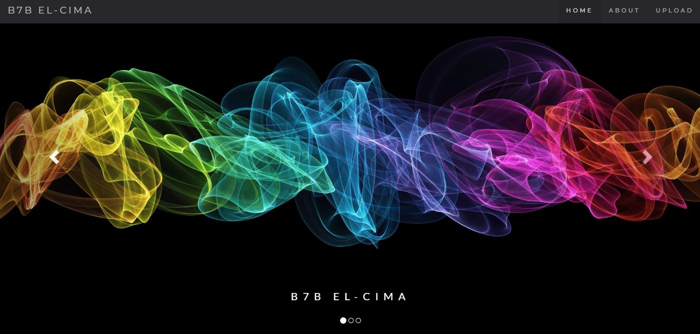
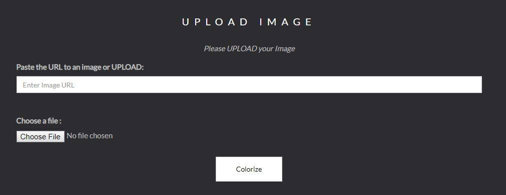
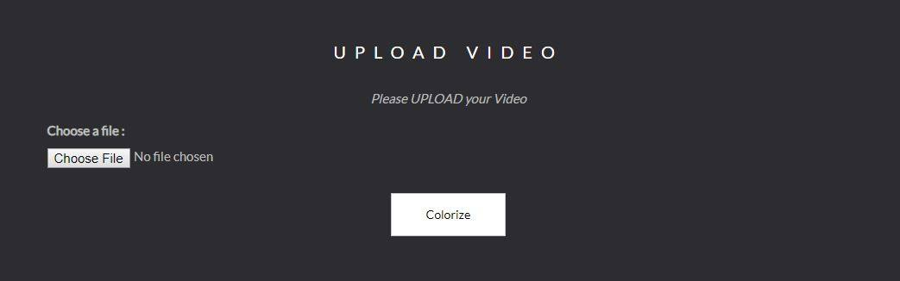
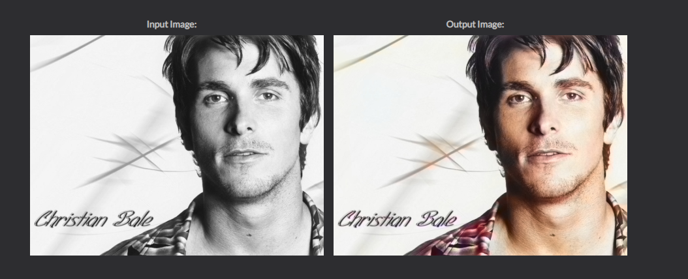
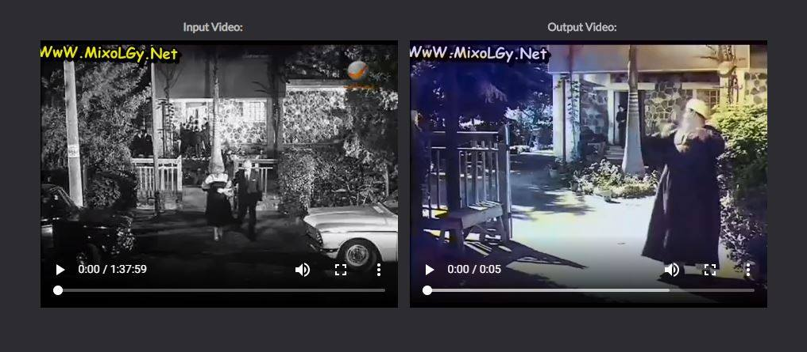

# b7b_el_cima

## Content
* [Overview](#overview)

* [Specifications](#specifications)

* [Model Architecture](#model-architecture)

* [How to use?](#how-to-use)

* [Examples](#examples) 

* [Our Team](#our-team)

* [License](#license)

---
## Overview
Academic project of an application that converts black and white videos or images into colored and nice ones.
For more, check our [Project Proposal](B7b%20El-Cima.pdf) and [Video](https://www.youtube.com/watch?v=HuqR4sw75ko)

 | 
-|-

---
## Specifications
A simple [website](http://127.0.0.1:5000) containing a colorization app for video or image

- The front-end is in [HTML5](https://developer.mozilla.org/en-US/docs/Web/Guide/HTML/HTML5), [CSS3](https://developer.mozilla.org/en-US/docs/Web/CSS/CSS3), [Javascript](https://www.javascript.com/), [Ajax](http://api.jquery.com/jquery.ajax/) and [Bootstrap 4](https://getbootstrap.com/).

- The back-end is in [Python 3](https://www.python.org/download/releases/3.0/) using [Flask](http://flask.pocoo.org/) framework.

- Model Architectures are written using [Keras](https://keras.io/).

- The Core project is developed using [Tensorflow](https://www.tensorflow.org/) and [OpenCV](https://opencv.org/).

- Models Training is done using [Colab](https://colab.research.google.com)

- Development is OS independent.

---
## Model Architecture
- We learned 3 different architectures
you can find all details [here](Model_Arch.md).

- By comparing the initial results of them the one which gave the best result was U-Net so we continue training on it. 

- We trained it by 66k images from old colored movies. you can find the dataset [here](https://drive.google.com/file/d/1g6wtlkZVHAMKwucdRPqke37aBcQaImWw/view).

- The training took 2 days on colab to make 20 epochs with batch size 32.

---
## How to use?
### 1) Download this repo
- From GitHub: Clone or Download the repository or
- From Git:
    > git clone https://github.com/SuperMoudy/b7b_el_cima

### 2) Download the model
- Create a new folder in the repo and name it "models"
- In this folder(models), download the model from [here](https://drive.google.com/file/d/1biUjfEqCFgmNGzGXg8yTf9vsXTsLaB39/view)

### 3) Install dependencies
- Using command line:
    > pip install -r requirements.txt

### 4) To run the website
- Go to the project directory
- Go to Web App
- Run command line there and type:
    > python abbas.py

### 5) To colorize an Image:
- Include a url or upload an image then click Colorize:

    

### 6) To colorize a Video:
- Upload a video then click Colorize:

    

---
## Examples
### Image

### Video

---
## Our Team
- [Aladdin Mostafa](https://github.com/Aladdin95)
- [Mohamed Hussein](https://github.com/teamleader6)
- [Rawan Mahmoud](https://github.com/RawanMahmoud)
- [Mado Mohamed](https://github.com/MadoMohamed)
- [SuperMoudy](https://github.com/SuperMoudy)

---
## License

